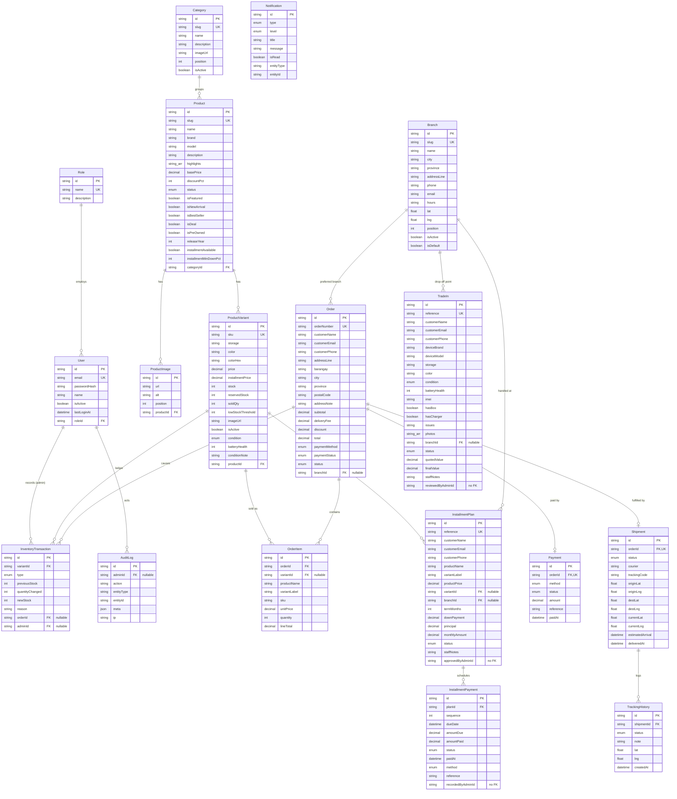

# Data Model — iStore

The database is PostgreSQL, modeled with Prisma ([`server/prisma/schema.prisma`](../server/prisma/schema.prisma)).
A generated SQL snapshot lives in [`generated-schema.sql`](./generated-schema.sql) (for reviewers without a DB).
Regenerate it **from `server/`** (the Prisma 7 CLI needs `prisma.config.ts` to find the schema — run from the repo root and it silently emits nothing):

```bash
cd server && npx prisma migrate diff --from-empty --to-schema prisma/schema.prisma --script -o ../docs/generated-schema.sql
```

**18 entities · 12 enums · 18 foreign keys · 61 indexes.**

## Guiding principles

1. **Admin-only accounts.** Only staff have `User` rows. Shoppers check out as **guests** — their details are captured inline on the `Order`. There is no customer login anywhere in the system.
2. **Money is `DECIMAL(12,2)`**, never a float — no rounding drift on prices or totals.
3. **Stock never changes without a ledger entry.** Every mutation of `ProductVariant.stock` is paired with an `InventoryTransaction` (RESTOCK / SALE / RETURN / ADJUSTMENT / CANCELLATION). The opening balance is itself a RESTOCK row.
4. **Orders snapshot their line items.** `OrderItem` copies `productName`, `variantLabel`, `sku`, and `unitPrice` at purchase time, so order history is immutable even if the catalog changes later.
5. **History outlives the catalog.** Variants with sales/inventory history can't be hard-deleted (`onDelete: Restrict`); the app archives via `isActive` / `status` instead. `OrderItem.variantId` is nullable + `SetNull` so an order survives if a variant is ever removed.
6. **Overselling is impossible under concurrency.** Order creation + stock deduction happen inside one `prisma.$transaction` that re-reads stock and rejects if `stock < quantity` (implemented with the order service in a later phase).
7. **Branches are locations, not warehouses.** A `Branch` is a customer-selectable shop — a preferred/pickup location and the point of contact for trade-ins and installments. The catalog and stock stay **global**: `Order.branchId`, `TradeIn.branchId`, and `InstallmentPlan.branchId` are all optional + `SetNull`, and none of them changes pricing or fulfilment. Once referenced, deactivate a branch via `isActive` instead of deleting it.
8. **Condition is per-unit; the pre-owned badge is per-listing.** `ProductVariant.condition` (with `batteryHealth` / `conditionNote`) is the per-unit truth, and the variant uniqueness key is `(productId, storage, color, condition)` — so a NEW and a PREOWNED "256GB · Black" coexist as separate variants with separate SKUs. `Product.isPreOwned` is a separate merchandising flag (badge, homepage rail, catalog filter) and is deliberately independent of it.
9. **Trade-in valuations are entered by staff, never derived.** The device fields on `TradeIn` are the customer's self-reported snapshot; `quotedValue` and `finalValue` are set by staff in the back-office as the request moves through `TradeInStatus`.
10. **Installments are price ÷ months — no interest, no fees.** The base is the variant's **installment price** (`ProductVariant.installmentPrice ?? price`, see 11). `InstallmentPlan.productPrice` snapshots it at apply time and is never overwritten; `principal = productPrice − downPayment` and `monthlyAmount = principal ÷ termMonths`, both computed and re-validated server-side. The `InstallmentPayment` schedule sums to exactly the principal (the last row absorbs rounding), and recording a payment updates its row — rows are never deleted.
11. **A variant carries two prices: cash and installment.** `ProductVariant.price` is the cash price — the only figure checkout ever charges (`order.service.ts` snapshots it onto `OrderItem.unitPrice`). `installmentPrice` is the separate, higher base a monthly plan is divided from, because financing is paid over time; JLP's price list quotes both per unit. It is **nullable**, and every consumer reads `installmentPrice ?? price`, so accessories and any row created before the column existed finance at their cash price with no backfill. Only the installment path reads it — cash checkout never does, and the two are labelled distinctly everywhere in the UI so they can't be confused.

## ER diagram



*Every model also carries `createdAt` (and `updatedAt` where its rows are mutable); those are left out above except where the timestamp is the point of the row.*

## Enums

| Enum | Values |
|------|--------|
| `ProductStatus` | DRAFT · ACTIVE · ARCHIVED |
| `OrderStatus` | RECEIVED · PROCESSING · PACKED · SHIPPED · IN_TRANSIT · OUT_FOR_DELIVERY · DELIVERED · CANCELLED |
| `PaymentMethod` | COD · GCASH · BANK_TRANSFER |
| `PaymentStatus` | PENDING · PAID · FAILED · REFUNDED |
| `ShipmentStatus` | PENDING · PREPARING · IN_TRANSIT · OUT_FOR_DELIVERY · DELIVERED · FAILED |
| `InventoryTxnType` | RESTOCK · SALE · RETURN · ADJUSTMENT · CANCELLATION |
| `NotificationType` | NEW_ORDER · LOW_STOCK · OUT_OF_STOCK · PAYMENT · SYSTEM |
| `NotificationLevel` | INFO · SUCCESS · WARNING · ERROR |
| `ProductCondition` | NEW · STANDARD · OPEN_BOX · PREOWNED · REFURBISHED |
| `TradeInStatus` | SUBMITTED · REVIEWING · QUOTED · ACCEPTED · DECLINED · COMPLETED · CANCELLED |
| `InstallmentStatus` | PENDING · APPROVED · ACTIVE · COMPLETED · REJECTED · CANCELLED |
| `InstallmentPaymentStatus` | PENDING · PAID |

`ProductCondition` is shared: it defaults to `NEW` on `ProductVariant` (the catalog) and to `PREOWNED` on `TradeIn` (a device being traded in). `STANDARD` is JLP's own shelf grading — a unit the shop has opened and tested, so it is offered on catalog variants but **excluded** from the customer-facing trade-in form (`tradein.validator.ts` narrows the enum), because it isn't a claim a seller can make about their own phone. `InstallmentPayment.method` reuses `PaymentMethod`.

## Referential actions (deletes)

| Relation | Action | Rationale |
|----------|--------|-----------|
| `User.role` → Role | Restrict | Can't delete a role that's still assigned. |
| `Product.category` → Category | Restrict | Can't delete a category with products. |
| `ProductImage.product` → Product | Cascade | Images are owned by the product. |
| `ProductVariant.product` → Product | Cascade | Variants are owned by the product… |
| `InventoryTransaction.variant` → ProductVariant | **Restrict** | …but a variant with a ledger can't be deleted, which transitively protects sold products (archive instead). |
| `OrderItem.order` → Order | Cascade | Items belong to the order. |
| `OrderItem.variant` → ProductVariant | SetNull | Order history survives variant removal (details are snapshotted). |
| `Payment.order` / `Shipment.order` → Order | Cascade | 1:1 children of the order. |
| `TrackingHistory.shipment` → Shipment | Cascade | Events belong to the shipment. |
| `InventoryTransaction.order` → Order | SetNull | Keep the ledger even if an order is purged. |
| `InventoryTransaction.admin` / `AuditLog.admin` → User | SetNull | Keep the audit trail even if an admin is removed. |
| `Order.branch` / `TradeIn.branch` / `InstallmentPlan.branch` → Branch | SetNull | A branch is a preference, not a dependency — the order/request survives it (deactivate via `isActive` rather than deleting). |
| `InstallmentPlan.variant` → ProductVariant | SetNull | The plan keeps its own `productName` / `variantLabel` / `productPrice` snapshot, so it survives catalog changes. |
| `InstallmentPayment.plan` → InstallmentPlan | Cascade | The schedule belongs to the plan. |

`TradeIn.reviewedByAdminId`, `InstallmentPlan.approvedByAdminId`, and `InstallmentPayment.recordedByAdminId` are **loose references with no foreign key** — same pattern as `Notification.entityId`. Staff attribution is informational and must never block deleting a `User`.

## Buy / Sell / Trade (JLP Gadgetz Center)

| Flow | Models | Who drives it |
|------|--------|---------------|
| **Buy** — new *and* pre-owned units | `Product` (`isPreOwned`) · `ProductVariant` (`condition`, `batteryHealth`, `conditionNote`) | The owner adds products in the admin; customers check out as guests. |
| **Sell / Trade** — trade a device in | `TradeIn` (+ optional `Branch`) | The customer submits online; **staff** review and set `quotedValue` / `finalValue`. |
| **Installments** — pay over 3/6/9/12 months | `InstallmentPlan` → `InstallmentPayment` (+ optional `Branch`, optional `ProductVariant`) | The customer applies online; **staff** approve and record each payment. |

The available terms (3/6/9/12 months) live in shared config, not the database. Branch selection is a **picker only** — every branch shares one global catalog and one global stock pool. Both `TradeIn` and `InstallmentPlan` carry human-facing references (`TRD-YYYYMMDD-####`, `INS-YYYYMMDD-####`) in the same shape as `Order.orderNumber`, and neither has a customer account behind it: the name/email/phone are captured inline, exactly as on `Order`.

## Simulated delivery (not real GPS)

`Shipment` and `TrackingHistory` carry `lat`/`lng` for the Leaflet/OpenStreetMap tracking map. These are **simulated** waypoints (Warehouse → Distribution Hub → In Transit → Out for Delivery → Delivered), clearly labeled as such in the UI. The model is shaped so a real courier API can later populate `currentLat`/`currentLng` without schema changes.
