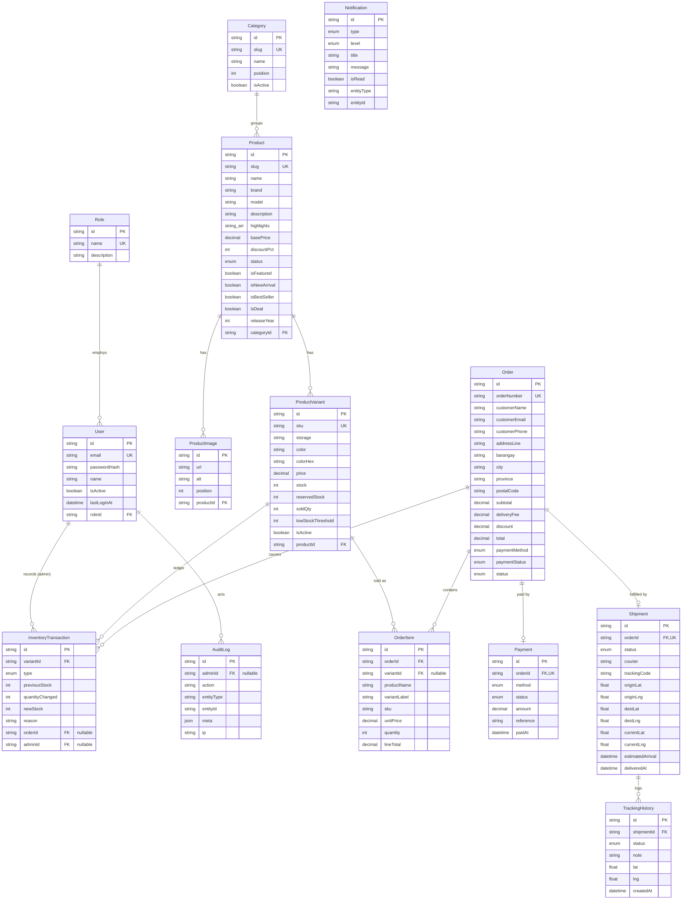

# Data Model — iStore

The database is PostgreSQL, modeled with Prisma ([`server/prisma/schema.prisma`](../server/prisma/schema.prisma)).
A generated SQL snapshot lives in [`generated-schema.sql`](./generated-schema.sql) (for reviewers without a DB).

**14 entities · 8 enums · 13 foreign keys · 38 indexes.**

## Guiding principles

1. **Admin-only accounts.** Only staff have `User` rows. Shoppers check out as **guests** — their details are captured inline on the `Order`. There is no customer login anywhere in the system.
2. **Money is `DECIMAL(12,2)`**, never a float — no rounding drift on prices or totals.
3. **Stock never changes without a ledger entry.** Every mutation of `ProductVariant.stock` is paired with an `InventoryTransaction` (RESTOCK / SALE / RETURN / ADJUSTMENT / CANCELLATION). The opening balance is itself a RESTOCK row.
4. **Orders snapshot their line items.** `OrderItem` copies `productName`, `variantLabel`, `sku`, and `unitPrice` at purchase time, so order history is immutable even if the catalog changes later.
5. **History outlives the catalog.** Variants with sales/inventory history can't be hard-deleted (`onDelete: Restrict`); the app archives via `isActive` / `status` instead. `OrderItem.variantId` is nullable + `SetNull` so an order survives if a variant is ever removed.
6. **Overselling is impossible under concurrency.** Order creation + stock deduction happen inside one `prisma.$transaction` that re-reads stock and rejects if `stock < quantity` (implemented with the order service in a later phase).

## ER diagram

## Enums

| Enum | Values |
|------|--------|
| `ProductStatus` | DRAFT · ACTIVE · ARCHIVED |
| `OrderStatus` | RECEIVED · PROCESSING · PACKED · SHIPPED · IN_TRANSIT · OUT_FOR_DELIVERY · DELIVERED · CANCELLED |
| `PaymentMethod` | COD · GCASH · BANK_TRANSFER |
| `PaymentStatus` | PENDING · PAID · FAILED · REFUNDED |
| `ShipmentStatus` | PENDING · PREPARING · IN_TRANSIT · OUT_FOR_DELIVERY · DELIVERED · FAILED |
| `InventoryTxnType` | RESTOCK · SALE · RETURN · ADJUSTMENT · CANCELLATION |
| `NotificationType` | NEW_ORDER · LOW_STOCK · OUT_OF_STOCK · PAYMENT · SYSTEM |
| `NotificationLevel` | INFO · SUCCESS · WARNING · ERROR |

## Referential actions (deletes)

| Relation | Action | Rationale |
|----------|--------|-----------|
| `User.role` → Role | Restrict | Can't delete a role that's still assigned. |
| `Product.category` → Category | Restrict | Can't delete a category with products. |
| `ProductImage.product` → Product | Cascade | Images are owned by the product. |
| `ProductVariant.product` → Product | Cascade | Variants are owned by the product… |
| `InventoryTransaction.variant` → ProductVariant | **Restrict** | …but a variant with a ledger can't be deleted, which transitively protects sold products (archive instead). |
| `OrderItem.order` → Order | Cascade | Items belong to the order. |
| `OrderItem.variant` → ProductVariant | SetNull | Order history survives variant removal (details are snapshotted). |
| `Payment.order` / `Shipment.order` → Order | Cascade | 1:1 children of the order. |
| `TrackingHistory.shipment` → Shipment | Cascade | Events belong to the shipment. |
| `InventoryTransaction.order` → Order | SetNull | Keep the ledger even if an order is purged. |
| `InventoryTransaction.admin` / `AuditLog.admin` → User | SetNull | Keep the audit trail even if an admin is removed. |

## Simulated delivery (not real GPS)

`Shipment` and `TrackingHistory` carry `lat`/`lng` for the Leaflet/OpenStreetMap tracking map. These are **simulated** waypoints (Warehouse → Distribution Hub → In Transit → Out for Delivery → Delivered), clearly labeled as such in the UI. The model is shaped so a real courier API can later populate `currentLat`/`currentLng` without schema changes.
